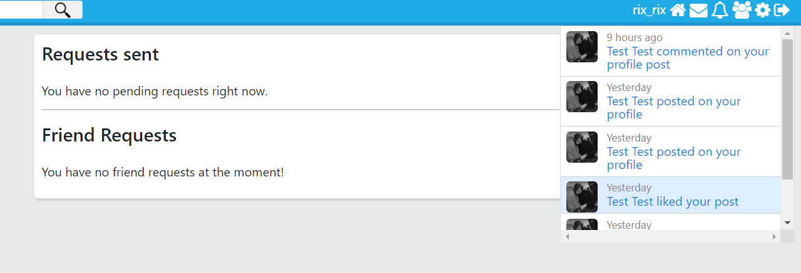

# Chat-app
#Social Media application with PHP, JS, MySQL

Users can sign up, create posts and upload images, like posts, comment on posts, chat with other users, see notifications and user profiles and add users as friends, change user settings, search for users with AJAX.
(Full-stack)

### Newsfeed

* Messages and notifications have a dropdown window handled with AJAX
